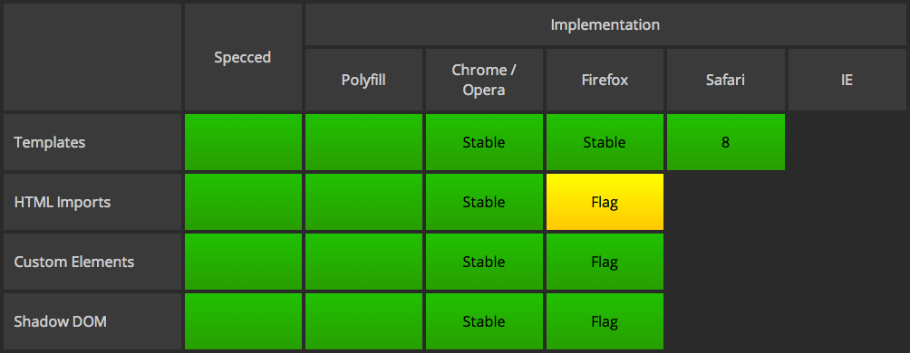
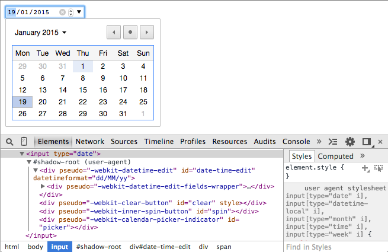
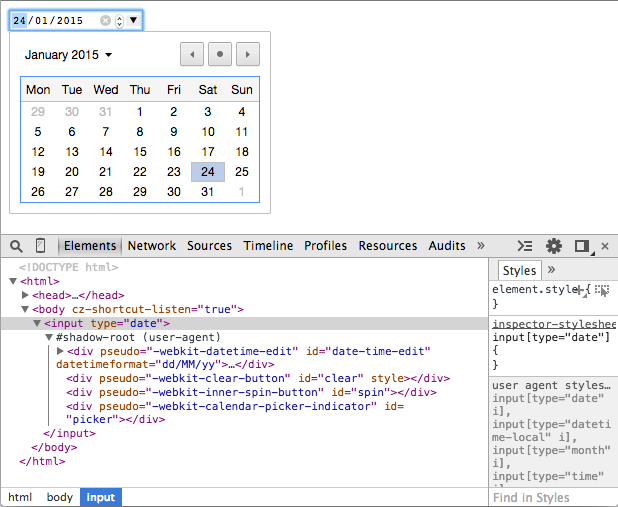
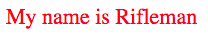
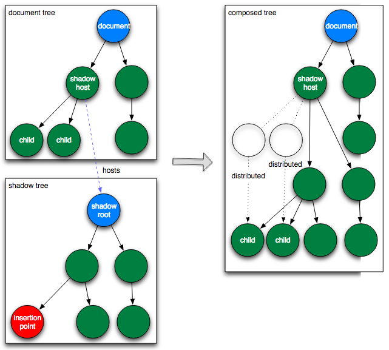
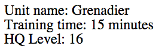
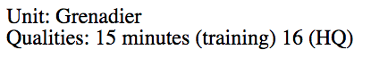

# Les nouveaux soldats du web : web components

> Dmytro Podyachiy [@dimapod79](https://twitter.com/dimapod79)
<br/>
> Benjamin Lacroix [@benjlacroix](https://twitter.com/benjlacroix)

---

# Plan de mission

* Aujourd'hui
* Réponse ciblée
* Renforts
* Règlement
* Caserne

---

# Aujourd'hui

--

## Déjà plusieurs factions

* jQuery plugins
* directives AngularJS
* vues BackbonesJS
* etc.

--

## Harmonieusement intégrées

Dépendances
```javascript
  <link rel="stylesheet" type="text/css" href="my-zooka.css" />
  <script src="my-zooka.js" />
```

Cible
```html
  <div id="my-zooka"></div>
```

Initialisation
```javascript
  new MyZooka(document.getElementById('my-zooka'));
```

--

## Composant initialisé

Domination
```html
<div id="my-zooka">
  <div class="team">Blue</div>
  <div class="name">Zooka</div>
  <div class="power">10</div>
  <div class="range">42</div>
</div>
```
Le code du plugin est partagé avec celui de la page : collisions multiples.

--

# Réponse ciblée
> ENCAPSULATION

---

# Renforts

--

## Qu'est ce qu'il manque ?

Dépendance
```javascript
<link rel="import" href="my-zooka.html"/>
```
Utilisation
```javascript
<my-zooka/>
```
Le navigateur se charge de résoudre `my-zooka` et d'encapsuler le markup dans un fragment *encapsulé*.

--

Les web components sont un ensemble de technologies :

* [Custom Element](http://www.html5rocks.com/en/tutorials/webcomponents/customelements/)
* [HTML Templates](http://www.html5rocks.com/en/tutorials/webcomponents/template/)
* [HTML Imports](http://www.html5rocks.com/en/tutorials/webcomponents/imports/)
* [Shadow DOM](http://www.html5rocks.com/en/tutorials/webcomponents/shadowdom/)


---

# Règlement

--

Depuis *juillet 2014* la [W3C](http://www.w3.org/wiki/WebComponents/) propose un début de spécification pour les web components.

--

## Tableau des compatibilités



source : [are-we-componentized-yet](http://jonrimmer.github.io/are-we-componentized-yet/)

--

A partir de ces spécifications des bibliothèques permettent la compatibilité.

* [Polyfill](http://webcomponents.org/polyfills/)
* [Polymer](https://www.polymer-project.org/)
* [X-Tag](http://www.x-tags.org/)
* [Brick](http://bricksjs.com/index.html)
* [Bosonic](http://bosonic.github.io/)

---

# Caserne

---

# Custom Element

> Provide a way for Web developers to build their own, fully-featured DOM elements.
> Rationalize the platform. [W3C](http://w3c.github.io/webcomponents/spec/custom/#dfn-help-web-developers)

--

Les `Custom Elements` sont des objets dont l'interface est défini par le développeur.

Les nouveaux éléments DOM ainsi créées permettent de :

1. Définir des nouveaux éléments HTML/DOM
1. Etendre d'autres éléments ex. : [HTMLButtonElement](https://developer.mozilla.org/en/docs/Web/API/HTMLButtonElement)
1. Encapsuler des fonctionnalités sur mesure
1. Etendre l'API d'élément HTML/DOM existants

--

## Définir un nouvel élément

Le nom du composant doit contenir un caractère`U+002D HYPHEN-MINUS` et **ne doit pas** contenir des caractères ASCII en majuscule. [W3C](http://w3c.github.io/webcomponents/spec/custom/#dfn-custom-element-type).

Certains noms sont réservées :

* annotation-xml
* color-profile
* font-face
* font-face-src
* [...](http://w3c.github.io/webcomponents/spec/custom/#dfn-custom-element-type)

--


## Cycle de vie et callbacks

Le `Custom Element` traverse différents états durant son [cycle de vie](http://w3c.github.io/webcomponents/spec/custom/#dfn-lifecycle-callbacks).

* `createdCallback` appelé après la création et l'enregistrement de la définition de l'élément.
* `attachedCallback` appelé à l'insertion de l'élément dans le document lorsque celui-ci a un contexte.
* `detachedCallback` appelé à la suppression de l'élément du document lorsque celui-ci a un contexte.
* `attributeChangedCallback` appelé au changement d'attributs de l'élément.

--

#### Les `Custom Elements` sont créé en utilisant `document.registerElement()` :

```javascript
var ZookaButton = document.registerElement('zooka-button');
```
```html
<body>
  <zooka-button>Zooka</zooka-button>
</body>
```
> Par défault les `Custom Elements` héritent de `HTMLElement`.

--

#### Le `Custom Element` est configurable à travers son prototype.

```javascript
var ZookaButtonPrototype = Object.create(HTMLElement.prototype);
ZookaButtonPrototype.who = function() {
  alert('Zooka!');
}
document.registerElement('zooka-button', {prototype: ZookaButtonPrototype});
```

--

#### Avec des `callbacks` c'est mieux :).

```javascript
var ZookaButtonPrototype = Object.create(HTMLElement.prototype);
ZookaButtonPrototype.who = function() {...}
ZookaButtonPrototype.createdCallback = function() {
  this.addEventListener('click', function(e) {
    ZookaButtonPrototype.who();
  });
}
document.registerElement('zooka-button',
  {prototype: ZookaButtonPrototype});
```
[Exemple](example/custom-element0.html)

--

#### On change le contenu du `Custom Element` ?
```javascript
var ZookaButtonPrototype = Object.create(HTMLElement.prototype);
ZookaButtonPrototype.who = function() {...}
ZookaButtonPrototype.createdCallback = function() {
  this.addEventListener('click', function(e) {...});
  this.innerHTML = "<b>I am a Zooka button</b>";
}
document.registerElement('zooka-button',
  {prototype: ZookaButtonPrototype});
```
[Exemple](example/custom-element1.html)

---

# HTML Templates

--

#### Possibilité d'utiliser des templates HTML

```html
<template id="zooka-template">
  <b>I am a zooka button from template</b>
</template>
```
```javascript
var ZookaButtonPrototype = Object.create(HTMLElement.prototype);
ZookaButtonPrototype.who = function() {...}
ZookaButtonPrototype.createdCallback = function() {
  this.addEventListener('click', function(e) {...});
  var template = document.getElementById('zooka-template');
  var clone = document.importNode(template.content, true);
  this.innerHTML = clone;
}
document.registerElement('zooka-button',
{prototype: ZookaButtonPrototype});
```
[Exemple](example/custom-element2.html)

---

# HTML Imports

> Stocker toute la déclaration d'un web components dans un fichier externe.

--

#### Pourquoi ?

Un import HTML aujourd'hui c'est :

* `<iframe>`
* `ajax`
* encapsulé dans des balises `<script>`

> Génial ! ... ou pas.

--

## Les web components apportent la solution !

--

```html
<template>...</template>
```
```javascript
(function() {
  var importDoc = document.currentScript.ownerDocument;
  var ZookaButtonPrototype = Object.create(HTMLElement.prototype);
  ZookaButtonPrototype.who = function() {...}
  ZookaButtonPrototype.createdCallback = function() {...}
  document.registerElement('zooka-button',
    {prototype: ZookaButtonPrototype});
})()
```

```html
<html>
  <head>
    <link rel="import" href="zooka-button.html">
  </head>
  <body></body>
</html>
```

[Exemple](example/custom-element3.html)

> Attention au CORS.

---

# Shadow DOM

> Encapsulation in action

--

#### Les développeurs doivent pouvoir agir<br> comme les éditeurs de navigateurs

[Mark Dalgleish](http://markdalgleish.com/)

--

### Vendor element

```<input type="date">```



--

### Vendor element

```<input type="date">```



--

## Shadow boundary

--

### [Example](example/shadow-dom-0.html)

Shadow host
```html
<div id="boomUnit">Rifleman</div>
```

Shadow dom
```javascript
var shadow = document.getElementById('boomUnit').createShadowRoot();
shadow.innerHTML =
    "<style>div { color: red; }</style>" +
    "<div>My name is <content></content></div>";
```

--

### Resultat

Rendering



DOM Généré
```html
<div id="boomUnit">
  #shadow-root
  |  <style>
  |    div {
  |      color: red;
  |    }
  |  </style>
  |  <div>
  |     My name is <content></content>
  |  </div>
  "Rifleman"
</div>
```

--

## Insertion points

```<content select="">```
<br>
<br>

* sont les invitations pour le contenue
* ne deplacent pas le DOM
* projection de DOM

--

### Distribution


--

### [Example #1](example/shadow-dom-1.html)

Shadow host
```html
<div id="boomUnit">
    <span class="unit-name">Grenadier</span>
    <span class="training-time">15 minutes</span>
    <span class="hq-level">16</span>
</div>
```

Shadow element
```html
<template id="unitTemplate">
<div>
    Unit name: <content select=".unit-name"></content> <br>
    Training time: <content select=".training-time"></content> <br>
    HQ Level: <content select=".hq-level"></content>
</div>
</template>
```

```javascript
var shadow = document.getElementById('boomUnit').createShadowRoot();
var template = document.getElementById('unitTemplate');
shadow.appendChild(document.importNode(template.content, true));
```

--

### [Resultat #1](example/shadow-dom-1.html)

Rendering



DOM Généré
```html
<div id="boomUnit">
  #shadow-root
  |  <div>
  |     Unit name: <content select=".unit-name"></content> <br>
  |     Training time: <content select=".training-time"></content> <br>
  |     HQ Level: <content select=".hq-level"></content> <br>
  |  </div>
  <span class="unit-name">Grenadier</span>
  <span clas="training-time">15 minutes</span>
  <span class="hq-level">16</span>
</div>
```

--

### [Example #2](example/shadow-dom-2.html)

Shadow host
```html
<div id="boomUnit">
    <span class="unit-name">Grenadier</span>
    <span class="training-time">15 minutes (training) </span>
    <span class="hq-level">16 (HQ)</span>
    <div>The Grenadier is a big and powerful long-range unit</div>
</div>
```

Shadow element
```html
<template id="unitTemplate">
<div>
    Unit: <content select=".unit-name"></content> <br>
    Qualities: <content select="span"></content>
</div>
</template>
```

```javascript
var shadow = document.getElementById('boomUnit').createShadowRoot();
var template = document.getElementById('unitTemplate');
shadow.appendChild(document.importNode(template.content, true));
```

--

### [Resultat #2](example/shadow-dom-2.html)

Rendering



DOM Généré
```html
<div id="boomUnit">
  #shadow-root
  |  <div>
  |    Unit: <content select=".unit-name"></content> <br>
  |    Qualities: <content select="span"></content>
  |  </div>
  <span class="unit-name">Grenadier</span>
  <span class="training-time">15 minutes</span>
  <span class="hq-level">16</span>
  <div>The Grenadier is a big and powerful long-range unit</div>
</div>
```

--

## [Shadow DOM Visualizer](http://html5-demos.appspot.com/static/shadowdom-visualizer/index.html)

> By Eric Bidelman

--

## Styling

--

### Shadow boundary

* Selectors ne traversent pas le shadow boundary
* Encapsulation des styles du monde externe

--

### Styling the host element

> `:host` selector

[Example](example/styling-0.html)

```html
<button class="btn">
  #shadow-root
  |  <style>
  |    :host { text-transform: uppercase; }
  |    :host(.btn) { color: blue; }
  |    :host(:hover) { color: red; }
  |  </style>
  |  <div>
  |    <content></content>
  |  </div>
  "Zooka"
</button>
```

--

### Context (Thèmes)

> `:host-context` selector

[Example](example/styling-1.html)

```html
<body class="offensive">
  <div id="unitName">
    #shadow-root
    |  <style>
    |    :host-context(.defensive) { color: green; }
    |    :host-context(.offensive) { color: red; }
    |  </style>
    |  <div>
    |    <content></content>
    |  </div>
    "Tank"
  </div>
</body>
```

--

### Styling Shadow DOM internals
(depuis l'exterieur)

<br>

* `::shadow` pseudo-element

* `/deep/` combinator

--

### `::shadow`

Permet de percer à travers d'un Shadow DOM's boundary


DOM
```html
<div id="buildings">
  #shadow-root
  |  <span class="level-1">Outpost</span>
  |  <x-div>
  |    #shadow-root
  |    |  <span class="level-2">Radar</span>
  |  </x-div>
</div>
```

Host
```html
<style>
#buildings::shadow .level-1 { background: red; }
#buildings::shadow x-div::shadow .level-2 { background: green; }
</style>
```

--

### `/deep/`

Ignores all shadow boundaries

DOM
```html
<div id="troops">
  #shadow-root
  |  <span class="level-1">Heavy</span>
  |  <x-div>
  |    #shadow-root
  |    |  <span class="level-2">Medic</span>
  |  </x-div>
</div>
```

Host
```html
<style>
#troops /deep/ .level-2 { color: orange; }
</style>
```

--

### CSS Variables

Shadow
```html
<template id="nameTagTemplate">
<style>
   span {
      color: var(--my-text-color, pink);
   }
</style>
<span>WebComponents</span>
</template>
```

Host
```html
<style>
 #host {
   --my-text-color: green;
 }
</style>
```

[Disponible](http://caniuse.com/#feat=css-variables) seulement sur Firefox

---

# Communication

--

## Component ⇾ Host

* par evenements

--

### Par evenements

Component ⇾
```javascript
var proto = Object.create(HTMLElement.prototype);
proto.createdCallback = function() {
	// shadow DOM management ...

	this.addEventListener('click', function(e) {
		this.dispatchEvent(new Event('fire-tank'));
	});
};
document.registerElement('boom-tank', {prototype: proto});
```

⇾ Host
```javascript
document.addEventListener('fire-tank', function (event) {
    // logic
}, true);
```

--

## Host ⇾ Component

* par surveillance des attibuts
* par des méthodes du prototype

--

### Par surveillance des attibuts

Host ⇾
```javascript
var xElement = document.querySelector('boom-grenadier');
xElement.setAttribute('action', 'launch');
```

⇾ Component
```javascript
var proto = Object.create(HTMLElement.prototype);
proto.createdCallback =  ...
proto.attributeChangedCallback = function(attrName, oldVal, newVal) {
    // logic
};

document.registerElement('boom-grenadier', {prototype: proto});
```

--

### Par methodes sur prototype

Host ⇾
```javascript
var xElement = document.querySelector('boom-zooka');
xElement.fireWithBazooka(forceLevel);
```

⇾ Component
```javascript
var proto = Object.create(HTMLElement.prototype);
proto.createdCallback =  ...
proto.fireWithBazooka = function(data) {
    // logic
};

document.registerElement('boom-zooka', {prototype: proto});
```

---

# Prêt pour la bataille ?

---

# Workshop

> A vous de jouer !
