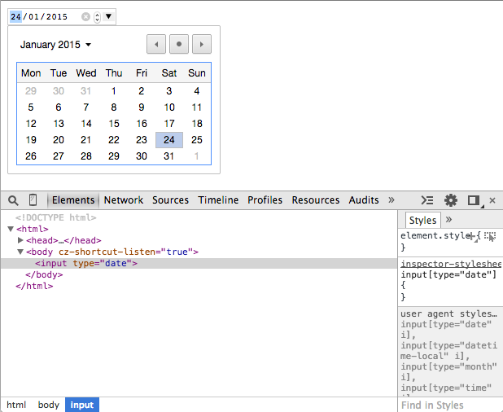

# Les nouveaux soldats du web : web components

> Dmytro Podyachiy [@dimapod79](https://twitter.com/dimapod79)
<br/>
> Benjamin Lacroix [@benjlacroix](https://twitter.com/benjlacroix)

---

# Plan de mission

* Aujourd'hui
* Réponse ciblée
* Renforts
* Règlement
* Caserne

---

# Aujourd'hui

--

## Déjà plusieurs factions

* jQuery plugins
* directives AngularJS
* Vues BackbonesJS

--

## Harmonieusement intégrées

Dépendances
```javascript
  <link rel="stylesheet" type="text/css" href="my-zooka.css" />
  <script src="my-zooka.js" />
```

Cible
```html
  <div id="my-zooka"></div>
```

Initialisation
```javascript
  new MyZooka(document.getElementById('my-zooka'));
```

--

## Composant initialisé

Domination
```html
<div id="my-zooka">
  <div class="team">Blue</div>
  <div class="name">Zooka</div>
  <div class="power">10</div>
  <div class="range">42</div>
</div>
```
Le code du plugin est partagé avec celui de la page : collisions multiples.

--

# Réponse ciblée
> ENCAPSULATION

---

# Renforts

--

## Qu'est ce qu'il manque ?

Dépendance
```javascript
<link rel="import" href="my-zooka.html"/>
```
Utilisation
```javascript
<my-zooka/>
```
Le navigateur se charge de résoudre `my-zooka` et d'encapsuler le markup dans un fragment *encapsulé*.

--

Les web components sont un ensemble de technologies :

* [Custom Element](http://www.html5rocks.com/en/tutorials/webcomponents/customelements/)
* [HTML Templates](http://www.html5rocks.com/en/tutorials/webcomponents/template/)
* [HTML Imports](http://www.html5rocks.com/en/tutorials/webcomponents/imports/)
* [Shadow DOM](http://www.html5rocks.com/en/tutorials/webcomponents/shadowdom/)


---

# Règlement

--

Depuis *juillet 2014* la [W3C](http://www.w3.org/wiki/WebComponents/) propose un début de spécification pour les web components.

--

## Tableau des compatibilités


> <span style="color: yellow">jaune</span> : en cours de développement
<br/>
> <span style="color: green">vert</span> : presque terminé

source : [are-we-componentized-yet](http://jonrimmer.github.io/are-we-componentized-yet/)

--

A partir de ces spécifications des bibliothèques permettent la compatibilité.

* [Polyfill](http://webcomponents.org/polyfills/)
* [Polymer](https://www.polymer-project.org/)
* [X-Tag](http://www.x-tags.org/)
* [Brick](http://bricksjs.com/index.html)
* [Bosonic](http://bosonic.github.io/)

---

# Caserne

---

# Custom Element

> Provide a way for Web developers to build their own, fully-featured DOM elements.
> Rationalize the platform. [W3C](http://w3c.github.io/webcomponents/spec/custom/#dfn-help-web-developers)

--

Les `Custom Elements` sont des objets dont l'interface est défini par le développeur.

Les nouveaux éléments DOM ainsi créées permettent de :

1. Définir des nouveaux éléments HTML/DOM
1. Etendre d'autres éléments ex. : [HTMLButtonElement](https://developer.mozilla.org/en/docs/Web/API/HTMLButtonElement)
1. Encapsuler des fonctionnalités sur mesure
1. Etendre l'API d'élément HTML/DOM existants

--

## Définir un nouvel élément

Doit contenir un caractère`U+002D HYPHEN-MINUS` et **ne doit pas** contenir des caractères ASCII en majuscule. [W3C](http://w3c.github.io/webcomponents/spec/custom/#dfn-custom-element-type).

Certains noms sont réservées :

* annotation-xml
* color-profile
* font-face
* font-face-src
* [...](http://w3c.github.io/webcomponents/spec/custom/#dfn-custom-element-type)

--


## Cycle de vie

1. création de l'élément avant qu'il soit enregistré
1. la définition du nouvel élément est enregistrée
1. l'instance de l'élément est créé après que la définition soit enregirstré
1. l'élément

---

# HTML Templates

---

# HTML Imports

---

# Shadow DOM

--

#### Les développeurs doivent pouvoir agir<br> comme les éditeurs de navigateurs

--

### Vendor element

```<input type="date">```



--

## Shadow boundary

--

### Example

Shadow host
```html
<div id="nameTag">Bob</div>
```

Shadow root
```html
<template id="nameTagTemplate">
<style>
   div { color: red; }
</style>
<div>
    My name is <content></content>
</div>
</template>
```

```javascript
var shadow = document.querySelector('#nameTag').createShadowRoot();
var template = document.querySelector('#nameTagTemplate');
var clone = document.importNode(template.content, true);
shadow.appendChild(clone);
```

--

## Insertion points

* sont les invitations pour le contenue
* ne deplacent pas le DOM
* projection de DOM

<br>
```<content select="">```


--

## Distributions

A `distribution` is the mechanism that determines which nodes appear at each insertion point. [W3C](http://w3c.github.io/webcomponents/spec/shadow/#distributions)

--

#### Simple Distribution


--

### Example #1

Shadow host
```html
<div id="nameTag">
    <span class="name">Bob</span>
    <span class="age">21</span>
</div>
```

Template (insertion points)
```html
<template id="nameTagTemplate">
<div>
    My name is <content select=".name"></content>.
    I’m <content select=".age"></content> years old.
</div>
</template>
```
--

### Example #2

Shadow host
```html
<div id="nameTag">
    <span class="name">Bob</span>
    <span class="age">21</span>
</div>
```

Template (insertion points)
```html
<template id="nameTagTemplate">
<div>
    My name is <content select="span"></content>.
    I’m <content select=".age"></content> years old.
</div>
</template>
```

--

## Styling

--

### Shadow boundary

* Selectors don't cross the shadow boundary
* Style encapsulation from the outside world

--

### Styling the host element

Host
```html
<button class="btn">My Button</button>
```

Shadow
```html
<style>
 :host { text-transform: uppercase; }
 :host(.btn) { color: blue; }
 :host(:hover) { color: red; }
</style>
```

--

### Theming an element

Host
```html
<body class="theme-big">
<div id="nameTag">
    <span>Tom</span>
</div>
</body>
```

Shadow
```html
<style>
	:host-context(.theme-big) { font-size: 2em; }
	:host-context(.theme-small) { font-size: .5em; }
</style>
```
--

### Styling Shadow DOM internals

* `::shadow` pseudo-element

* `/deep/` combinator


--

### `::shadow`

Permet de percer à travers d'un Shadow DOM's boundary


DOM
```html
<div id="nameTag" class="btn">
  #shadow-root
  |   <span class="level-1">Web</span>
  |   <x-div>
  |     #shadow-root
  |     |   <span class="level-2">Components</span>
  |   </x-div>
</div>
```

Host
```html
<style>
#nameTag::shadow .level-1 { background: red; }
#nameTag::shadow x-div::shadow .level-2 { background: green; }
</style>
```

--

### `/deep/`
Ignores all shadow boundaries

DOM
```html
<div id="nameTag" class="btn">
  #shadow-root
  |   <span class="level-1">Web</span>
  |   <x-div>
  |     #shadow-root
  |     |   <span class="level-2">Components</span>
  |   </x-div>
</div>
```

Host
```html
<style>
#nameTag /deep/ .level-2 { color: orange; }
</style>
```

--

### CSS Variables


Shadow
```html
<template id="nameTagTemplate">
<style>
   span {
      color: var(--my-text-color, pink);
   }
</style>
<span>WebComponents</span>
</template>
```

Host
```html
<style>
 #host {
   --my-text-color: green;
 }
</style>
```

[Disponible](http://caniuse.com/#feat=css-variables) seulement sur Firefox

---

# Communication

---

# Prêt pour la bataille ?

---

# Workshop

> A vous de jouer !
