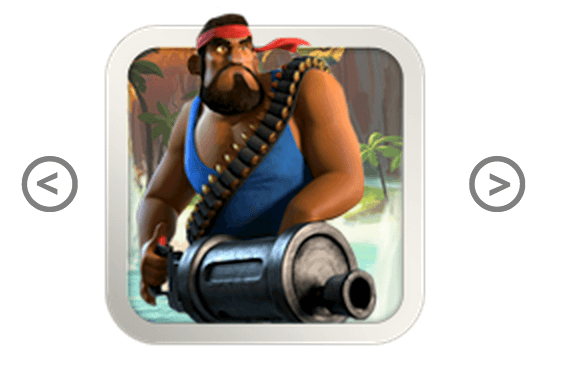

## Custom Element

L'objectif de cet exercice est de créer un custom element.

Le custom element doit se présenter sous la forme de :

```
<boom-carrousel>
  /* contenu HTML réprésentant le carrousel */
</boom-carrousel>
```



Il est composé d'une image centrale et de deux boutons latéraux.

URL des images :

```
  [
  'http://www.playboombeach.com/wp-content/uploads/grenadier.png?54c28a',
  'http://www.playboombeach.com/wp-content/uploads/heavy.png?54c28a',
  'http://www.playboombeach.com/wp-content/uploads/medic.png?54c28a',
  'http://www.playboombeach.com/wp-content/uploads/rifleman.png?54c28a',
  'http://www.playboombeach.com/wp-content/uploads/scorcher.png?54c28a',
  'http://www.playboombeach.com/wp-content/uploads/tank.png?54c28a',
  'http://www.playboombeach.com/wp-content/uploads/warrior.png?54c28a',
  'http://www.playboombeach.com/wp-content/uploads/zooka.png?54c28a'
  ]
```

[Exercice 1](html_template.md) > HTML Template
