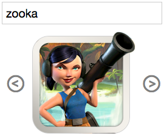

## Communication

Bravo, si vous êtes arrivé jusqu'à cet exercice c'est que vous commencez à comprendre comment fonctionnent les web components.

Plus qu'une seule chose, comment communiquer depuis le web component, vers la page et vice versa ?

### Custom element ⇾ Page

Objective est de faire en sorte que le champ `input` (dans index.html) contienne le nom de l'image affichée.

- créez un champ `<input>` dans `index.html`
- dans le component [emettez l'événement](https://developer.mozilla.org/en-US/docs/Web/Guide/Events/Creating_and_triggering_events) lors de changement des images 
- dans index.html, ajouter un listener de cette événement pour changer le nom de unit

### Page ⇾ Custom element

Objective est d'afficher une image de unit correspondant quand le nom entré dans le champ `input` correspond au nom de unit.

#### Par API (méthodes du prototype)

- dans votre web component, créez une méthode `filterUnit(name)` qui prend en paramètre une string et affiche l'image de l'unité correspondante dans le carrousel
- faites-en sorte qu'à chaque modification du contenu de l'`<input>` l'image du carrousel soit changée en conséquence

#### Par surveillance des Attributs

- ajouter un attribut `filter` à votre web component
- faites-en sorte qu'à chaque modification de l'attribut l'image du carrousel soit changée en conséquence

[Prev](shadow_dom.md)
