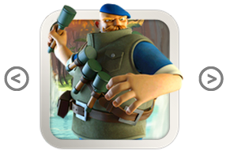

## HTML Template

L'objectif de ce second exercice, est d'utiliser un `<template>`.

- ajoutez un `<template></template>` dans votre page et injectez ce template dans le custom element à la place de `innerHTML`.
- vous pouvez ajouter un peu de styling:

```
button {
  height: 170px;
  vertical-align: top;
  font-size: 3em;
  border-radius: 28px;
  outline: none;
  background: none;
  border: none;
  color: gray;
}

button:hover {
  color: #000000;
}
```

**Voici le resultat:**




> N'hésitez pas à retourner voir les exemples de la présentation.

[Prev](ce.md) [Next](html_import.md)
