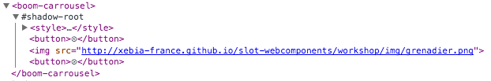

## Shadow DOM

- au lieu d'ajouter le template directement dans le noeud `<boom-carrousel/>` faites-en sorte de créer un noeud fantôme
- inspectez le DOM créé

Vous devez avoir quelque chose comme ça:

### Encapsulation du CSS

L'image n'a plus de fond rouge ! Mircale :). C'est l'encapsulation.

Essayez d'appliquer le fond rouge sur les images du carrousel depuis le [style](http://www.html5rocks.com/en/tutorials/webcomponents/shadowdom-201/) défini globalement dans l'`index.html`

[Prev](html_import.md) [Next](behaviour.md)
