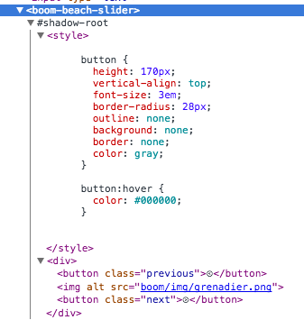

## Shadow DOM

Au lieu d'ajouter le template directement dans le noeud `<boom-carrousel/>` faites-en sorte de créer un noeud fantôme.

### Encapsulation du CSS

A côté de votre custom element, créez une balise `div` avec la classe `boom-css-encapsulation` et faites en sorte que cette `div` soit visible (customisez le fond, la taille, etc.)

Ajoutez également une autre `div` identique également dans votre page. Pourquoi la div n'est pas impactée par le style ?

Comment faire pour appliquer le [style](http://www.html5rocks.com/en/tutorials/webcomponents/shadowdom-201/) depuis l'extérieur du web component ?

[Exercice 3](communication.md) > Communication
